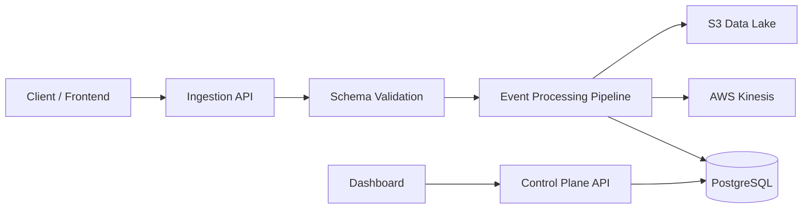

# 🚀 Real-Time Payment Streaming Platform

[]()
[]()
[]()
[]()
[]()
[]()

Production-style real-time event streaming system built with **Spring Boot, PostgreSQL (Docker), and AWS-style streaming architecture (Kinesis, S3)**.

---

## 🎯 Problem & Motivation

Modern payment systems generate high volumes of real-time events (e.g. `payment.created`, `payment.failed`, `refund.created`), but many systems struggle with:

- ❌ Tight coupling to cloud services (cannot run locally)
- ❌ Poor observability (silent failures, hard to debug)
- ❌ Lack of retry and failure recovery mechanisms
- ❌ Inconsistent data processing across services

---

## 💡 Idea

Design a **modular, production-style streaming system** that:

- Supports real-time ingestion, processing, and retry
- Decouples system components (API, streaming, processing, retry)
- Works both in **AWS cloud** and **local development**
- Provides full visibility into system behavior and failures

---

## 🚀 Solution

This project implements an **AWS-style event streaming pipeline**:

- 📥 Ingestion API (Spring Boot) for event intake and validation  
- 🔄 Streaming layer (Kinesis-style) for decoupling producers/consumers  
- ⚙️ Consumer service for idempotent processing  
- 🔁 Retry worker with exponential backoff + DLQ  
- 🧠 Control Plane API for monitoring and replay  
- 🗄 PostgreSQL for operational state  
- 🪣 S3-style data lake (raw + processed zones)  

### 🔑 Key Engineering Improvement

👉 Introduced **feature toggles (S3/Kinesis)** + **Flyway + Docker**, enabling:

- Full local execution without AWS  
- Faster debugging and development  
- Production behavior preserved  

---

## 📌 Project Evolution

| Phase | Focus | Outcome | Status |
|------|------|--------|--------|
| 🟢 Phase 1 | Prototype | Basic ingestion API & pipeline | ✔ Done |
| 🟡 Phase 2 | Backend Stabilization | Fixed runtime issues, added DB + local dev support | ✔ Done |
| 🔵 Phase 3 | Frontend Debug | Fix UI/API integration | 🔄 In Progress |
| 🟣 Phase 4 | Full System Testing | End-to-end validation | ⏳ Planned |
| 🔴 Phase 5 | Cloud Deployment | AWS deployment (ECS + Kinesis + S3) | ⏳ Planned |

---

## 🧠 Architecture Overview



---

## ⚙️ Tech Stack

- **Backend:** Spring Boot (Java 21)
- **Database:** PostgreSQL (Docker)
- **Streaming:** AWS Kinesis *(toggle-enabled for local)*
- **Storage:** AWS S3 *(optional)*
- **Infra:** AWS CDK (TypeScript)
- **Frontend:** React + TypeScript
- **Build:** Maven

---

## 🚀 Quick Start (Backend)

### 1️⃣ Start Database

```bash
docker compose up -d postgres
```

### 2️⃣ Run Backend

```bash
cd backend/ingestion-service
SERVER_PORT=18081 mvn spring-boot:run
```

### 3️⃣ Test API

```bash
curl http://localhost:18081/events \
-H "Content-Type: application/json" \
-d '{
  "eventId":"demo",
  "eventType":"payment.created",
  "schemaVersion":1,
  "customerId":"customer-001",
  "amount":100,
  "currency":"AUD",
  "occurredAt":"2026-04-27T14:58:55+10:00",
  "metadata":{"source":"demo"}
}'
```

Expected response:

```json
{
  "status": "accepted"
}
```

---

## 🧪 Automated Smoke Test

```bash
bash scripts/test-ingestion-local.sh
```

---

## 🌐 Demo Status

| Layer | Status |
|------|--------|
| Backend API | ✅ Working locally |
| Database | ✅ Docker PostgreSQL |
| Streaming | ⚠️ Mocked locally |
| Frontend | 🔄 In Progress |
| Cloud Deployment | 🚧 Planned |

---

## 💡 Engineering Highlights

- Designed real-time event ingestion pipeline (production-style)
- Decoupled AWS dependencies for local development
- Implemented Flyway database migration
- Added structured logging for debugging
- Built automated pipeline validation script